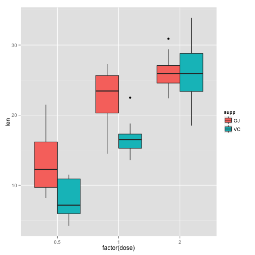

####Overview:
The goal of this project is to do some simple inferential data analysis. In this project I will perform basic exploratory data analysis and use hypothesis testing method on the Tooth Growth dataset. 

####Description of the data:
The Tooth Growth dataset shows the length of odontoblasts (teeth) in each of 10 guinea pigs at each of three dose levels of Vitamin C (0.5, 1, and 2 mg) with each of two delivery methods (orange juice or ascorbic acid).

####Basic summary of the data:
Load the data and provide basic summary statistics. (Appendix: A)

```
##    len supp dose
## 1  4.2   VC  0.5
## 2 11.5   VC  0.5
## 3  7.3   VC  0.5
## 4  5.8   VC  0.5
## 5  6.4   VC  0.5
## 6 10.0   VC  0.5
```

```
##       len        supp         dose      
##  Min.   : 4.20   OJ:30   Min.   :0.500  
##  1st Qu.:13.07   VC:30   1st Qu.:0.500  
##  Median :19.25           Median :1.000  
##  Mean   :18.81           Mean   :1.167  
##  3rd Qu.:25.27           3rd Qu.:2.000  
##  Max.   :33.90           Max.   :2.000
```
Basic summary shows that there are 60 observations total: 30 each of two delivery methods. I will group by supplement type to see if I can make any observation. (Appendix: B)

```
## Source: local data frame [2 x 4]
## 
##   supp min  max     mean
## 1   OJ 8.2 30.9 20.66333
## 2   VC 4.2 33.9 16.96333
```
Minimum length is lower (4.2) and maximum length is higher (33.9) with VC. OJ has higher mean value with 20.66.
Let's group by dose levels and compare. (Appendix: C)

```
## Source: local data frame [3 x 4]
## 
##   dose  min  max   mean
## 1  0.5  4.2 21.5 10.605
## 2  1.0 13.6 27.3 19.735
## 3  2.0 18.5 33.9 26.100
```
Summary shows that dose level and length have positive linear relationship.
Plotting box plots to show the relationship. (Appendix: D)
 

####Hypothesis Testing:
Since n is small, I use a T test.  My assumption is that each supplement groups are independent.  I don't know that sample tooth length values are normally distributed, since sample size is small (n = 30). Confidence level I use is 95%

####Hypothesis #1:
Null hypothesis is that tooth lengths are the same for both supplement type (VC or OJ). (Appendix: E)

```
## [1] -0.1710156  7.5710156
## attr(,"conf.level")
## [1] 0.95
```

####Hypothesis #2:
Subset the original dataset by dose level.  Null hypothesis is that tooth lengths are the same for both supplement type (VC or OJ) under each dose level. (Appendix: F)

```
## [1] 1.719057 8.780943
## attr(,"conf.level")
## [1] 0.95
```

```
## [1] 2.802148 9.057852
## attr(,"conf.level")
## [1] 0.95
```

```
## [1] -3.79807  3.63807
## attr(,"conf.level")
## [1] 0.95
```

####Conclusions:
Hypothesis Test #1 shows confidence interval between -0.17 and 7.57 at 95% level.  In other words, from the sample T test I can conclude that 95% of the time this interval contains the true mean.  Since the interval contains 0, null hypothesis is not rejected.
Hypothesis Test #2 has 3 tests, each one with different dose level.  For dose1 (0.5mg) and dose2 (1.0mg), null hypothesis is rejected because confidence interval is larger than 0.  For dose3 (2.0mg), null hypothesis is not rejected.  From the results, my conclusion is that at lower levels of dose (0.5 and 1.0mg), orange juice has greater effect on tooth length of guinea pigs. At higher level (2.0mg), the type of supplements did not affect the tooth length.

####Appendix:
R codes used in this report are shown.

(A)

```r
data(ToothGrowth)
head(ToothGrowth)
summary(ToothGrowth)
```
(B)

```r
suppressMessages(library(dplyr))
ToothGrowth %>%
        group_by(supp) %>%
        select(len, supp) %>%
        summarise_each(funs(min(., na.rm=TRUE), max(., na.rm=TRUE), mean(., na.rm=TRUE)))
```
(C)

```r
ToothGrowth %>%
        group_by(dose) %>%
        select(len, dose) %>%
        summarise_each(funs(min(., na.rm=TRUE), max(., na.rm=TRUE), mean(., na.rm=TRUE)))
```
(D)

```r
library(ggplot2)
ggplot(ToothGrowth, aes(x=factor(dose), y=len, fill=supp)) + geom_boxplot()
```
(E)

```r
t.test(len~supp, paired=FALSE, var.equal=FALSE, data=ToothGrowth, conf.level=0.95)$conf.int
```
(F)

```r
dose1 <- subset(ToothGrowth, dose==0.5)
dose2 <- subset(ToothGrowth, dose==1.0)
dose3 <- subset(ToothGrowth, dose==2.0)
t.test(len~supp, paired=FALSE, var.equal=FALSE, data=dose1, conf.level=0.95)$conf.int
t.test(len~supp, paired=FALSE, var.equal=FALSE, data=dose2, conf.level=0.95)$conf.int
t.test(len~supp, paired=FALSE, var.equal=FALSE, data=dose3, conf.level=0.95)$conf.int
```
